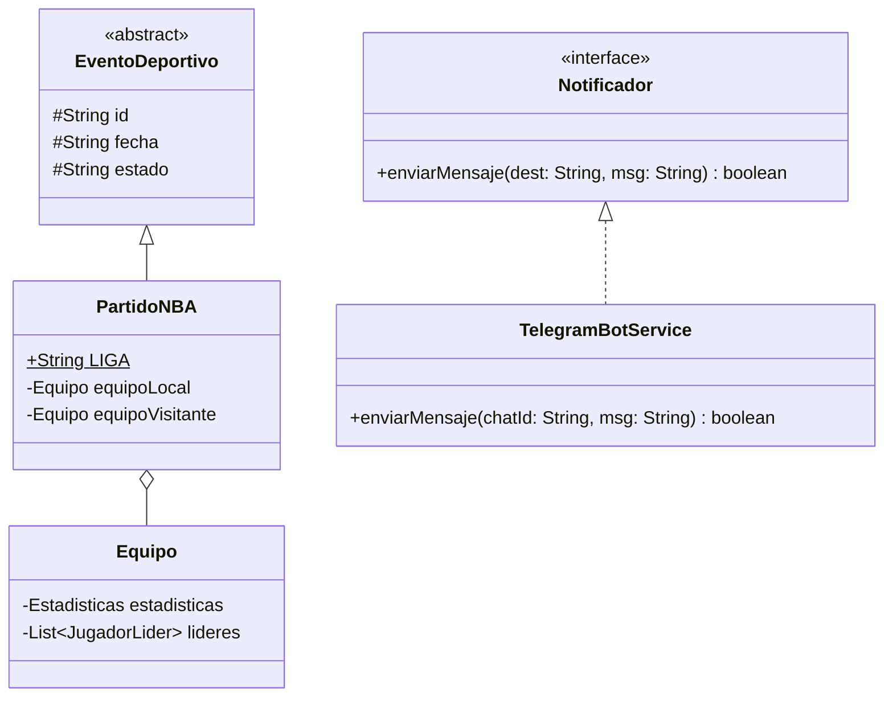

# 🏀 NBA Telegram Bot - Reporte Automatizado

Este proyecto es una aplicación backend en Java que actúa como un *middleware* de integración. Se encarga de consultar diariamente la API de ESPN para obtener los resultados y estadísticas de la jornada de la NBA, procesar y mapear los datos mediante Programación Orientada a Objetos (POO), y enviar un resumen formateado directamente a un chat de Telegram mediante un bot.

El proyecto está diseñado para ejecutarse de forma totalmente autónoma en la nube utilizando **GitHub Actions**.

## Características Principales

* **Consumo de APIs REST:** Peticiones HTTP eficientes a la API pública de ESPN usando `OkHttp3`.
* **Procesamiento de JSON:** Mapeo profundo de árboles JSON complejos a objetos Java nativos (POJOs) utilizando `Gson`.
* **Notificaciones Push:** Integración nativa con la API de Telegram Bots para enviar mensajes con formato HTML.
* **Automatización en la Nube:** Configurado como un *Cron Job* en GitHub Actions para ejecutarse todos los días de manera desatendida.
* **Gestión de Fecha Dinámica:** Calcula la fecha en tiempo real basándose en la zona horaria `America/Mexico_City`.

## Arquitectura

El sistema fue diseñado aplicando rigorosos principios de diseño de software:
* **Abstracción y Herencia:** Uso de una clase abstracta `EventoDeportivo` de la cual hereda la clase especializada `PartidoNBA`.
* **Composición y Agregación:** Relaciones estructuradas entre `Equipo`, `Estadisticas` y listas de `JugadorLider`.
* **Interfaces:** Uso de la interfaz `Notificador` para estandarizar el envío de mensajes, implementada por `TelegramBotService` (permitiendo escalar a otros medios como Email o WhatsApp en el futuro).
* **Responsabilidad Única (SRP):** Separación estricta entre la recolección de datos (`ApiRequest`), el mapeo (`JsonMapper`), la orquestación (`Main`) y la presentación (`ReporteGenerator`).

### Diagrama de Clases



## Guía de Instalación y Uso Local
**Prerequisitos:**
- JDK 21 - Amazon Coretto
- Maven
- Cuenta de Telegram

**1. Configurar Bot de Telegram**
1. Abre Telegram y busca `@BotFather`
2. Envía el comando `\newbot`, sigue pasos y copia el **Bot Token** generado.
3. Busca tu nuevo bot en Telegram y envíale un mensaje cualquiera (ej. "Hola") para abrir la comunicación.
4. Para obtener tu Chat ID personal, busca el bot `@userinfobot` y envíale `/start`. Copia el ID numérico que te devuelve.

**Clonar y configurar**
Clona el repositorio en tu máquina local:
```bash
git clone git clone [https://github.com/Roi-flores13/SportApiProject.git](https://github.com/Roi-flores13/SportApiProject.git)
cd SportsApiProyect
```

Crea un archivo llamado `config.properties` en la raíz del proyecto con la siguiente estructura (reemplaza con tus datos reales):
``` Properties
botToken=TU_TOKEN_DE_BOTFATHER
miChatId=TU_CHAT_ID_NUMERICO
botUsername=NombreDeTuBot
```

**3. Compilar y Ejecutar Localmente**
Para compilar el proyecto y descargar las dependencias, ejecuta:
```bash
mvn clean package -DskipTests
```

Para ejecutar la aplicación y recibir el reporte inmediatamente:
```bash
java -jar target/SportApiProject-1.0-SNAPSHOT-jar-with-dependencies.jar
```
## Despliegue Automatizado (GitHub Actions)
Este proyecto está listo para ejecutarse gratis en los servidores de GitHub todos los días.
1. Ve a la pestaña **settings** de tu repositorio de GitHub.
2. Navega a **Secretes and Variables** -> **Actions**.
3. Haz clic en **New repository secret** y agrega las siguientes tres variables (usando los mismos valores que en tu paso local):
   - `BOTTOKEN`
   - `MICHATID`
   - `BOTUSERNAME`
4. El archivo `.github/workflows/ejecutar-bot.yml` ya está configurado para ejecutarse diariamente (vía cron).
5. Si deseas probarlo manualmente, ve a la pestaña **Actions**, selecciona "Reporte Diario NBA Telegram" y presiona **Run workflow**.

## Tecnologías Utilizadas
- **Java 21** - Lenguaje principal.
- **Maven** - Gestor de dependencias y construcción.
- **OkHttp3 (v4.12.0)** - Cliente HTTP.
- **Gson (v2.10.1)** - Parser JSON.
- **TelegramBots (v6.8.0)** - API Wrapper oficial de Telegram.
